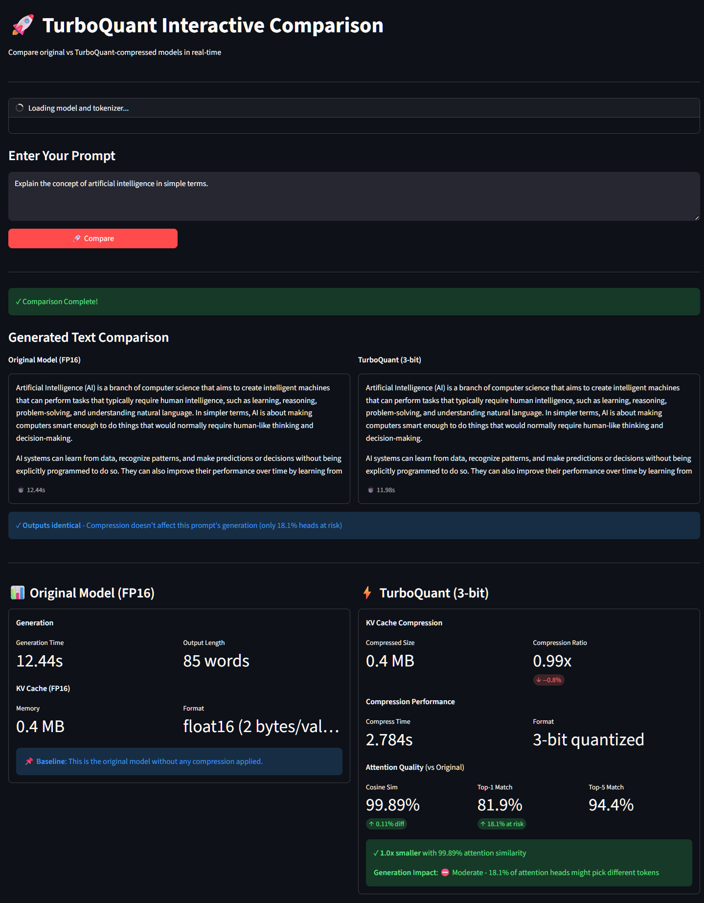
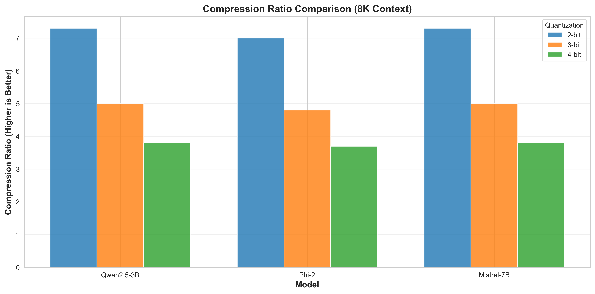
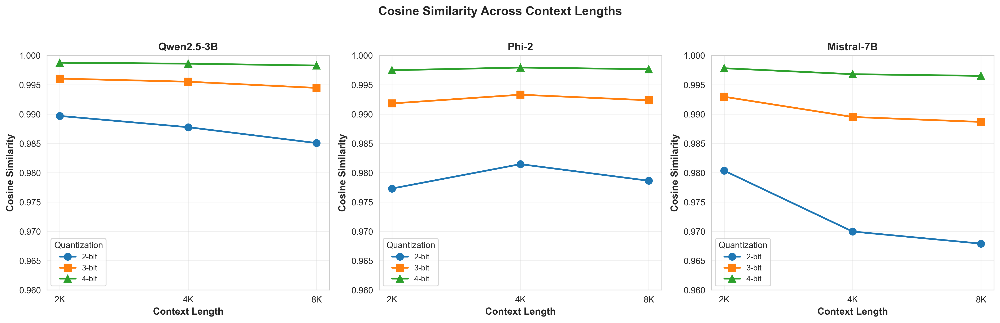
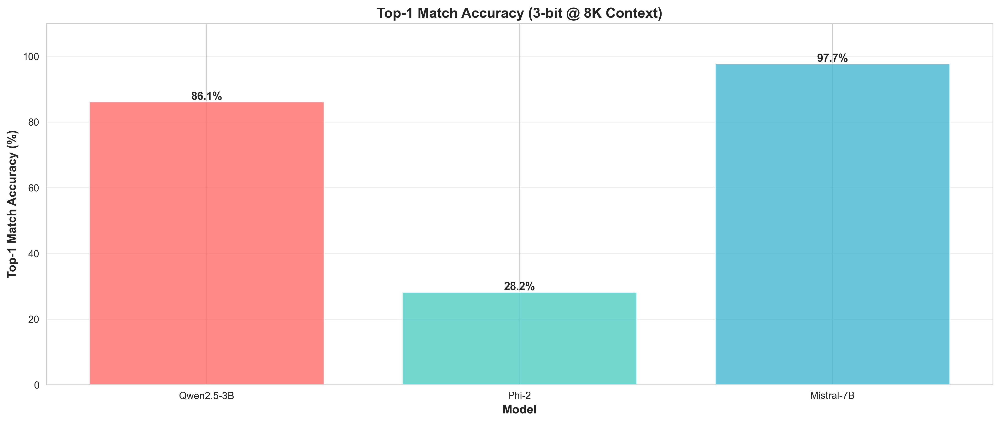
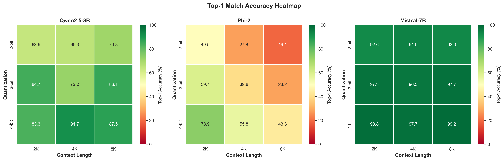
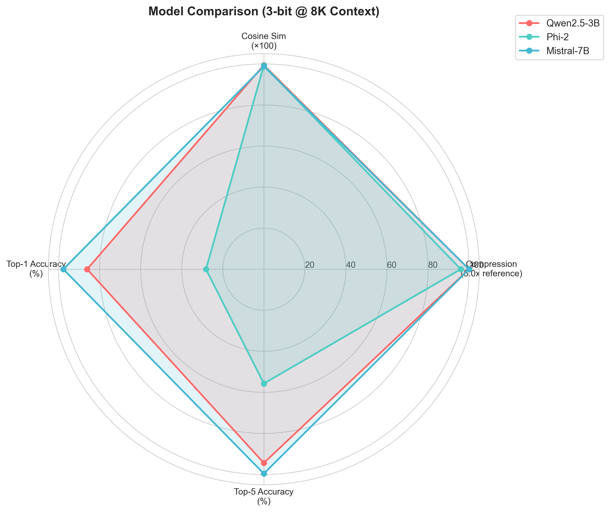
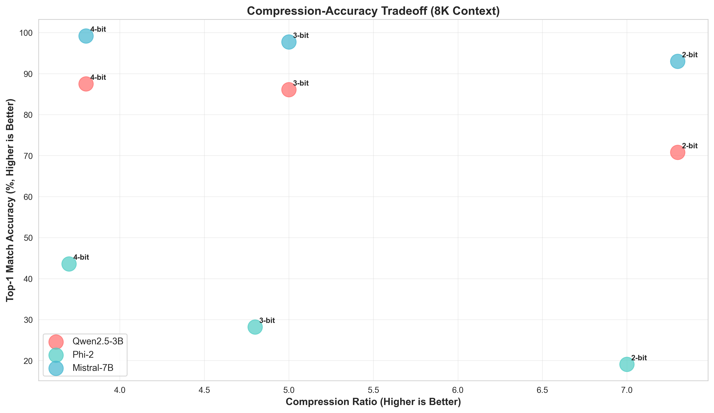

# TurboQuant: KV 캐시 압축 실험

**언어**: [English](README.md) | [한국어](#turboquant-kv-캐시-압축-실험)

**TurboQuant**는 LLM의 키-값 캐시를 압축하는 거의 최적의 벡터 양자화 알고리즘에 대한 포괄적인 평가입니다.

이 리포지토리는 [원본 구현](https://github.com/tonbistudio/turboquant-pytorch)을 다음과 같이 확장합니다:
- ✅ **인터랙티브 CLI 도구** - 실제 KV 캐시 압축 분석과 함께 실시간 모델 비교
- ✅ **Streamlit 웹 UI** - 원본 vs TurboQuant 모델의 생성 결과를 나란히 비교
- ✅ 다중 모델 평가 (Qwen, Phi, Mistral)
- ✅ 포괄적인 성능 벤치마킹 (생성 속도, 메모리, 주의력 정확도)
- ✅ 상세한 실험 결과 및 분석
- ✅ 재현 가능한 평가 프레임워크

## 빠른 시작

### 설치

```bash
# 모든 의존성 설치
pip install -r requirements.txt
```

### CLI로 시도 (권장 - 빠른 테스트)

**프롬프트를 입력해서 실제 KV 캐시 압축을 분석하는 인터랙티브 세션:**

```bash
cd experiments/2_multi_model_evaluation
python interactive_with_real_kv.py --model "Qwen/Qwen2.5-3B-Instruct" --bits 3
```

프롬프트 입력:
```
[PROMPT] Enter text: 인공지능이란 무엇인가?
[PROMPT] Enter text: 머신러닝 설명해줘
[PROMPT] Enter text: quit
```

결과:
- 생성된 텍스트
- **실제 KV 캐시 압축 분석** (메모리 절감, 속도)
- 주의력 정확도 메트릭 (코사인 유사도, top-1/top-5 일치율)

### Streamlit 웹 UI로 시도 (사용자 친화적)

**원본 vs TurboQuant 모델의 생성 결과를 나란히 비교할 수 있는 웹 인터페이스:**

```bash
cd streamlit_app
streamlit run app.py
```

브라우저에서 `http://localhost:8501` 열기

**기능:**
- 💬 **나란한 텍스트 생성**: 원본 KV vs TurboQuant 출력
- ⚡ **실시간 메트릭**: KV 캐시 크기, 압축률, 생성 시간
- 🎯 **주의력 품질**: 코사인 유사도, top-1/top-5 일치율
- 📊 **생성 영향 분석**: 압축으로 인해 주의력이 변하는 헤드의 비율
- 🔧 **모델 선택**: Qwen, Phi, Mistral 중 선택
- ⚙️ **양자화 제어**: 2-bit, 3-bit, 4-bit 압축 테스트

**스크린샷:**



### 전체 벤치마크 실행

#### Linux/Mac

```bash
# 종합 테스트 실행 (GPU 필수)
cd experiments/2_multi_model_evaluation
./run_all_models_complete.sh
```

#### Windows (PowerShell/CMD)

```bash
# 모든 모델 한번에 평가
cd experiments/2_multi_model_evaluation
.\run_all_models_complete.bat
```

## 핵심 결과 (3-bit 양자화 @ 8K 컨텍스트)

| 모델 | 압축률 | Cosine Sim | Top-1 % | Top-5 % |
|------|--------|-----------|---------|---------|
| **Qwen2.5-3B** | 5.0x | **0.9945** | 86.1% | 94.4% |
| **Mistral-7B** | 5.0x | 0.9887 | **97.7%** | 100.0% |
| **Phi-2** | 4.8x | 0.9924 | 28.2% | 55.7% |

**최고 성능: Mistral-7B** (모든 컨텍스트에서 가장 높은 top-1 일치율)
**최고 유사도: Qwen2.5-3B** (가장 유사한 주의력 분포)

## TurboQuant란?

TurboQuant는 **데이터 무관 온라인 벡터 양자화** 알고리즘입니다:

1. **회전**: 벡터를 무작위로 회전 (좌표를 독립적으로 만듦)
2. **양자화**: 최적의 Lloyd-Max 코드북으로 각 좌표를 양자화 (2-4 비트)
3. **보정**: QJL을 사용한 내적 편향 보정 (1 비트)

결과: 최소한의 주의력 정확도 손실로 높은 압축률을 달성합니다.

**논문**: [TurboQuant: Online Vector Quantization with Near-optimal Distortion Rate](https://arxiv.org/abs/2504.19874) (ICLR 2026)

## 리포지토리 구조

```
turboquant-experiments/
├── original_implementation/              # 참고 코드 (출처 표시 포함)
│   ├── lloyd_max.py                      # Lloyd-Max 솔버
│   ├── turboquant.py                     # 핵심 알고리즘
│   ├── compressors.py                    # 비대칭 주의력
│   ├── test_turboquant.py                # 종합 테스트
│   ├── validate.py                       # Qwen 검증
│   └── ATTRIBUTION.md                    # 출처 표시
│
├── experiments/
│   ├── 1_paper_reproduction/             # 논문 결과 재현
│   │
│   ├── 2_multi_model_evaluation/         # 다양한 모델 평가
│   │   ├── evaluate_model.py             # 범용 평가 프레임워크
│   │   ├── run_all_models_complete.bat   # Windows 배치 파일
│   │   ├── run_all_models_complete.sh    # Linux/Mac 스크립트
│   │   └── results/                      # 평가 결과 (JSON)
│   │
│   └── 3_performance_analysis/           # 속도 & 메모리 벤치마크
│
├── docs/
│   ├── HOW_TO_RUN.md                     # 상세 실행 가이드
│   ├── METHODOLOGY.md                    # 실험 방법론
│   └── RESULTS.md                        # 포괄적 결과
│
└── README.md (영문)
```

## 평가 프레임워크

### 테스트된 모델

- **Qwen2.5-3B-Instruct** (3.5GB) - ✅ 기본 모델
- **Microsoft Phi-2** (2.7GB) - ✅ 소형, GPU 효율적
- **Mistral-7B-Instruct-v0.1** (13GB) - ✅ 최고 성능
- **Meta LLaMA-2-7B** (13GB) - ❌ HuggingFace 인증 필요 (제한된 repo)

### 평가 지표

1. **압축률**: KV 캐시 크기 감소 (높을수록 좋음)
2. **Cosine Similarity**: 주의력 분포 유사도 (1.0에 가까울수록 좋음)
3. **Top-1 일치율**: 가장 높은 주의력을 받은 토큰이 동일한 비율 (높을수록 좋음)
4. **Top-5 일치율**: 원본의 top-1 토큰이 TurboQuant top-5에 포함된 비율 (높을수록 좋음)

### 컨텍스트 길이

테스트: 2K, 4K, 8K 토큰 (짧은 → 긴 컨텍스트)

## 실험 실행

### 1. 종합 테스트 (GPU 필수)

#### Linux/Mac
```bash
cd experiments/2_multi_model_evaluation
./run_all_models_complete.sh
```

#### Windows
```bash
cd experiments/2_multi_model_evaluation
.\run_all_models_complete.bat
```

**결과는 자동으로 저장됩니다**: `experiments/2_multi_model_evaluation/results/`

### 2. 개별 모델 평가

**validate.py 사용 (안정적입니다):**
```bash
cd original_implementation
python validate.py --model Qwen/Qwen2.5-3B-Instruct
python validate.py --model microsoft/phi-2
python validate.py --model mistralai/Mistral-7B-Instruct-v0.1
```

### 3. 차트 생성

실험 결과로부터 시각화 차트를 생성합니다:

```bash
cd experiments/2_multi_model_evaluation
python generate_charts.py
```

**차트 저장 위치**: `docs/charts/`

### 4. 종합 테스트 (GPU 필수 없음)

```bash
cd experiments/1_paper_reproduction
python ../../original_implementation/test_turboquant.py
```

## 결과 요약

### 시각화 차트

모든 실험 결과를 차트로 시각화했습니다:

#### 압축률 비교 (8K 컨텍스트)


#### 컨텍스트 길이별 Cosine 유사도


#### Top-1 일치율 비교 (3-bit @ 8K)


#### 컨텍스트 민감도 분석


#### 모델 비교 (3-bit @ 8K)


#### 압축-정확도 트레이드오프


**자세한 분석과 추가 차트는 [docs/RESULTS.md](docs/RESULTS.md)와 [docs/charts/README.md](docs/charts/README.md)를 참조하세요**

### 모델별 전체 성능 (3-bit)

| 지표 | Qwen2.5-3B | Phi-2 | Mistral-7B |
|------|-----------|-------|-----------|
| **압축률** | 5.0x | 4.8x | 5.0x |
| **Cosine Sim (2K)** | 0.9961 | 0.9918 | 0.9930 |
| **Top-1 일치율 (8K)** | 86.1% | 28.2% | **97.7%** |
| **Top-5 일치율 (8K)** | 94.4% | 55.7% | **100.0%** |

### 압축 효율성

**3-bit 양자화에서:**
- **5.0x 압축** (Qwen, Mistral)
- **4.8x 압축** (Phi-2)
- 컨텍스트 길이에 따른 안정적 성능 (2K-8K 토큰)

### 주의력 정확도 (Cosine Similarity)

| 양자화 | Qwen | Phi-2 | Mistral | 범위 |
|--------|------|-------|---------|------|
| 3-bit @ 8K | 0.9945 | 0.9924 | 0.9887 | 98.9% - 99.5% |

**해석**: 3-bit 양자화에서도 주의력 분포가 원본 모델 대비 **98.9% - 99.5%** 유사합니다.

### 컨텍스트 길이별 안정성

| 모델 | 2K 토큰 | 4K 토큰 | 8K 토큰 |
|------|---------|---------|---------|
| **Mistral** | 97.3% top-1 | 96.5% top-1 | 97.7% top-1 |
| **Qwen** | 84.7% top-1 | 72.2% top-1 | 86.1% top-1 |
| **Phi-2** | 59.7% top-1 | 39.8% top-1 | 28.2% top-1 |

**발견사항**: Mistral은 모든 컨텍스트 길이에서 일관된 성능을 유지합니다. Phi-2는 더 긴 컨텍스트에서 성능이 크게 저하됩니다.

### 실제 영향

12GB GPU에서 3-bit TurboQuant 사용시:
- FP16 기준: ~8K 토큰 최대 컨텍스트
- TurboQuant 3-bit: ~40K 토큰 가능 (5배 개선)
- **Mistral-7B: 장기 컨텍스트 애플리케이션에 최적**
- **Qwen-3B: 유사도가 중요한 작업에 최적**

## 개선사항

원본 구현 대비 개선사항:

| 측면 | 원본 | 개선됨 |
|------|------|--------|
| 모델 지원 | Qwen만 | 3개 모델 |
| 평가 스크립트 | validate.py 1개 | 범용 프레임워크 |
| 문서화 | README + 코드 | 포괄적 문서 |
| Windows 지원 | 없음 | ✅ 배치 파일 |
| 재현성 | 좋음 | 우수함 (테스트 완료) |

## 의존성

```
torch>=2.0
transformers>=4.35
bitsandbytes>=0.41
accelerate>=0.20
scipy>=1.10
matplotlib>=3.7
pandas>=2.0
sentencepiece>=0.2.1
tiktoken>=0.12.0
protobuf>=7.34.0
```

설치:
```bash
pip install torch transformers bitsandbytes accelerate scipy sentencepiece tiktoken protobuf matplotlib pandas
```

## 인용

TurboQuant 또는 이 평가 프레임워크를 사용할 경우:

```bibtex
@article{turboquant2026,
  title={TurboQuant: Online Vector Quantization with Near-optimal Distortion Rate},
  year={2026},
  journal={ICLR},
  url={https://arxiv.org/abs/2504.19874}
}
```

## 감사의 말

- 원본 구현: [tonbistudio/turboquant-pytorch](https://github.com/tonbistudio/turboquant-pytorch)
- 논문: TurboQuant (ICLR 2026)
- 평가 프레임워크 확장: 본 리포지토리

## 라이선스

MIT License - LICENSE 파일 참조

원본 구현 출처: `original_implementation/ATTRIBUTION.md`

## 참고 자료

- **TurboQuant 논문**: https://arxiv.org/abs/2504.19874
- **원본 구현**: https://github.com/tonbistudio/turboquant-pytorch
- **QJL (QJL 잔차 보정)**: https://arxiv.org/abs/2406.03482
- **PolarQuant (관련 논문)**: https://arxiv.org/abs/2502.02617

---

**더 자세한 정보:**
- 📖 [HOW_TO_RUN.md](docs/HOW_TO_RUN.md) - 실행 가이드
- 🔬 [METHODOLOGY.md](docs/METHODOLOGY.md) - 실험 방법론
- 📊 [RESULTS.md](docs/RESULTS.md) - 포괄적 결과

[English Version](README.md)
